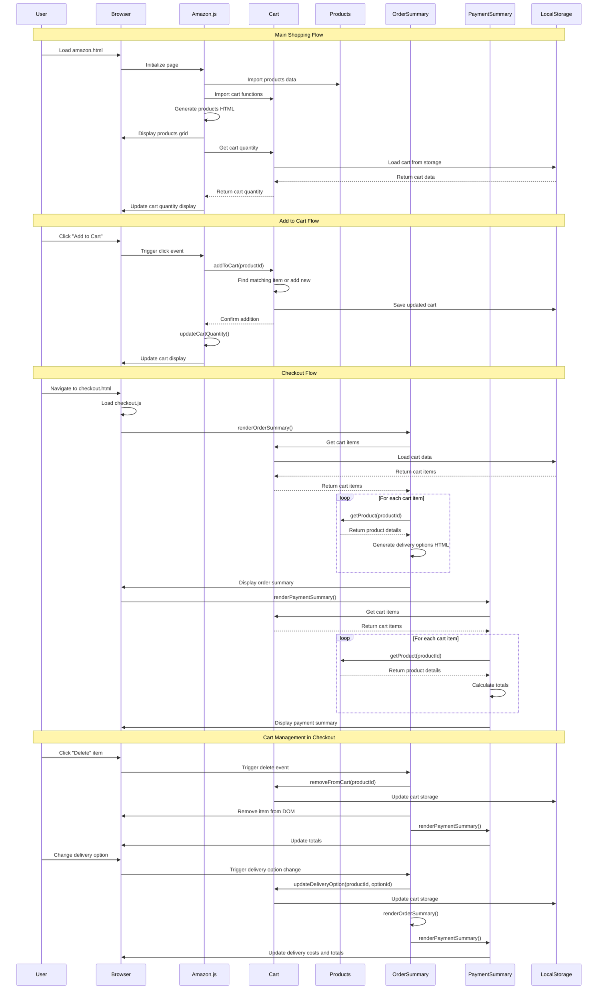

# Amazon Frontend Clone

A shopping cart web app that mimics Amazon's core functionality. Built to practice JavaScript fundamentals and learn e-commerce architecture.

## Features

- Browse products with ratings and prices
- Add/remove items and adjust quantities
- Multiple delivery options (free 7-day, $4.99 3-day, $9.99 next-day)
- Order summary with tax and shipping calculations
- Persistent cart data (survives page refresh)

## Tech Stack

- **Vanilla JavaScript** - No frameworks, focused on fundamentals
- **HTML/CSS** - Clean, responsive UI
- **Day.js** - Date calculations
- **localStorage** - Cart persistence
- **Jasmine** - Unit testing

## Key Learnings

**JavaScript Architecture**: Built cart functionality three ways (functions → objects → ES6 classes) to understand different approaches and their tradeoffs.

**Testing**: First time writing unit tests. Initially felt like overhead but saved significant debugging time during refactoring.

**Code Organization**: Evolved from single file to modular structure. Massive improvement in maintainability.

**Real-world Complexity**: Edge cases (empty carts, invalid products, date handling) revealed hidden complexity in "simple" features.

## Next Steps

- User authentication
- Backend API integration
- Mobile responsiveness
- Product search functionality

## Architecture Flow

